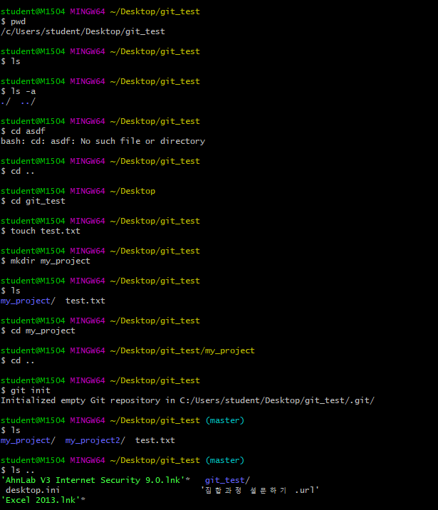

# linux 기초 문법

linux에서 사용 가능한 기본 문법을 정리합니다.


## 현재 폴더 위치

- pwd (print working directory)

```shell
$ pwd
```


## 폴더 변경

- cd (change directory)

```shell
$ cd <이동하고 싶은 폴더 이름>
```


## 폴더, 파일 출력

- ls(list)
  - `-a` 옵션을 추가해주면 숨김 파일까지 출력해 준다.

```shell
$ ls -a
# -a 옵션은 숨김 파일까지 출력해준다.
```


## 파일 생성

- touch

```shell
$ touch <생성할 파일 이름>
```


## 파일 삭제

- rm
  - 만약 폴더 삭제하고 싶다면 `-r` 옵션을 추가하여 삭제 가능.

```shell
$ rm <삭제하고 싶은 파일 이름>
$ rm -r <삭제하고 싶은 폴더 이름>
```

